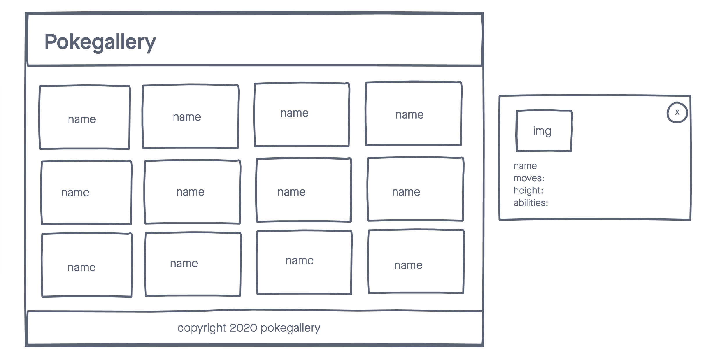

# Pokegallery

a simple web application that displays pokemon data using the pokemon API

## Tech Used
- **HTML5**
- **JAVASCRIPT**
- **JQUERY**
- **GOOGLE FONTS**
- **JQUERY MODAL**
- **POKEMON API**

## SCREENSHOTS

## Getting started

[click here](#) to see the deployed app!

## Future Enancements
-The ability to save favorites to localstorage
